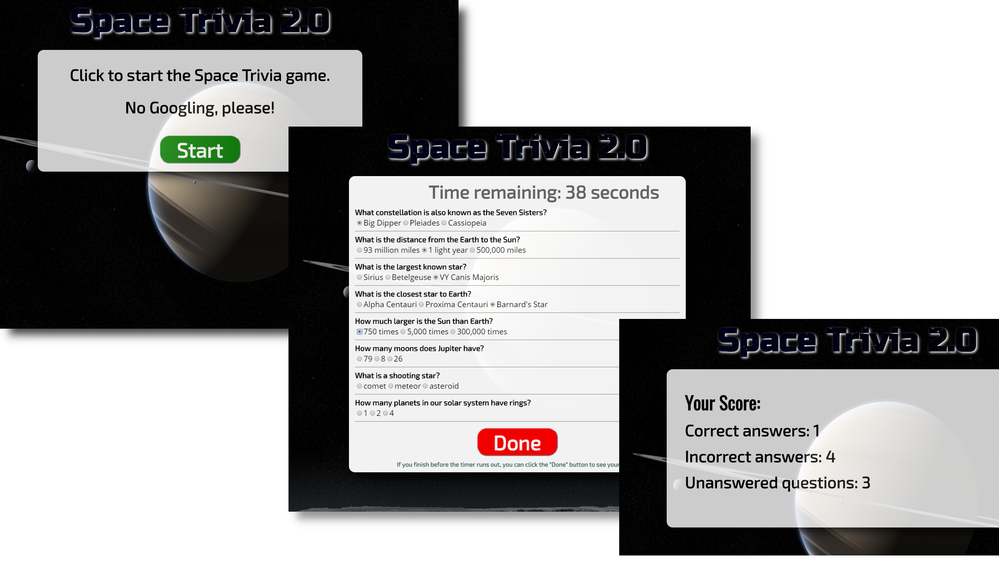
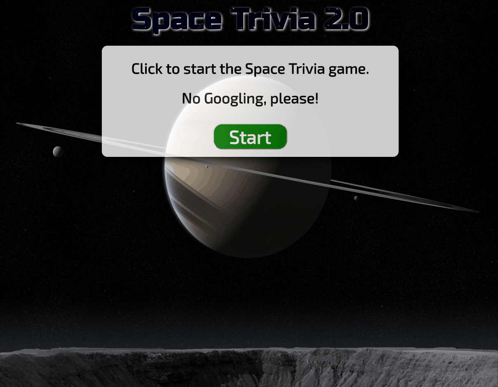

# SpaceTrivia_refactored



## [Space Trivia deployed app](https://dirk-kiesewetter.github.io/SpaceTrivia_refactored/)

---

This is the Space Trivia game refactored for cleaner code &amp; ES6 syntax. The questions are no longer hard-coded, but are generated dynamically. In addition, the questions have been moved into a separate JavaScript file for better modularity.

The original version can be found here: 

## About Space Trivia:

The goal of **Space Trivia** is to correctly answer all of the questions by selecting the correct radio button. Wrong answers are scored separately from questions that are not answered. A start button begins the game, and the game ends either when the timer runs out or the user clicks the done button.

## Description of the problem:

Space Trivia needed to display questions and radio buttons for possible answers on screen. Questions and answers are in an array of objects. Each object contains the question, an array of possible answers, and the correct answer.

There also needed to be a way to check user answers against an array of objects, with each question an individual object. The questions needed to be scored correctly, and a timer would start counting down once the user clicked `start`. Correct answers, incorrect answers, and unanswered questions were to be scored separately.

## Technical Solutions:

- The questions and possible answers are dynamically generated.
- The questions and answers are stored in an array of objects, inside the file ```questions.js```.
- A for loop iterates through the questions array and checks the user answer against the correct answer.
- JavaScript conditionals increment the appropriate score counter based on whether the question was answered correctly, incorrectly, or not at all.
- The timer is managed by a function that runs the setInterval() method. Once the timer runs out, the user is sent to the score page.

## How the app is organized:

Space Trivia has an HMTL document for structure and the question coding, JavaScript for game logic, functions, and scoring, a separate JavaScript file for the questions/answers array, and CSS for the style.

## How to run Space Trivia:

Space Trivia can either be run from the hosted site (link is above) or you can download the files to a local directory and open the HTML document in a web browser.

## Demo:



## Built with:

- JavaScript
- jQuery
- HTML 5
- CSS 3

## Authors:

**Space Trivia** was coded by me, and is maintained by me.

## Future development:

- Make app more mobile-friendly with larger radio buttons
- add button for user to return to start screen
- improve modularity/allow user to customize game with different background images/app title etc.
